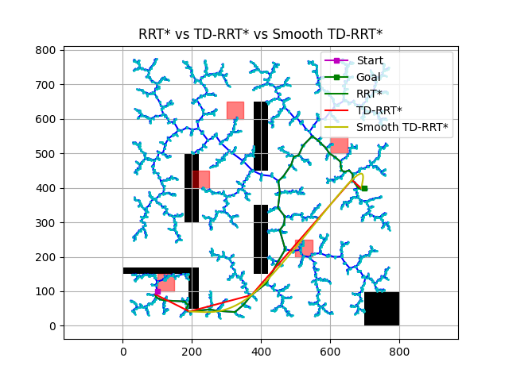

#  TD-RRT* Path Planning with Catmull-Rom Smoothing

A Python implementation of a **Triangluar Decomposition RRT*** (TD-RRT*) based real-time path planner for a non-holonomic mobile robot in a 2D environment. This implementation includes static and dynamic obstacles, triangle decomposition for path simplification, and Catmull-Rom spline interpolation for smooth path generation.

## Contributors

- [Sivaram Dheeraj Vishnubhotla](https://github.com/VVSDheeraj)  
- [Alexander Charles Hall](https://github.com/ahall113) 

## Sample Output

The algorithm generates visual plots comparing:
- RRT* path (green)
- Triangle-decomposed path (red)
- Smoothed Catmull-Rom path (yellow)

    

## Features

- **RRT\*** path planner with asymptotic optimality  
- **Dynamic obstacle avoidance**  
- **Triangle Decomposition** to reduce redundant waypoints  
- **Catmull-Rom spline interpolation** for smooth navigation  
- **Custom obstacle map** with both static and dynamic elements  
- **Performance metrics**: path cost, path size, and execution time  

## How It Works

1. **Sampling**: Points are randomly sampled within the map.
2. **Tree Growth**: Nearest low-cost nodes are found using `find_near_nodes` and rewiring optimizes path segments.
3. **Obstacle Checking**: Collision detection with both static and dynamic obstacles.
4. **Backtracking**: Once the goal is found, the optimal path is reconstructed.
5. **Triangle Decomposition**: Path is simplified by removing unnecessary intermediate nodes.
6. **Path Smoothing**: Final path is smoothed using Catmull-Rom interpolation.


## Requirements

**Requirements:**
- Python 3.8+
- NumPy
- Matplotlib

Install dependencies using:

```bash
pip install numpy matplotlib
